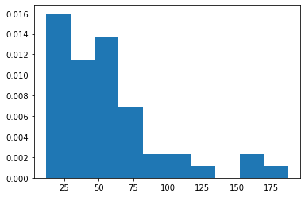
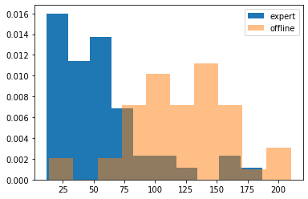
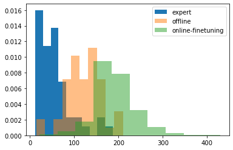
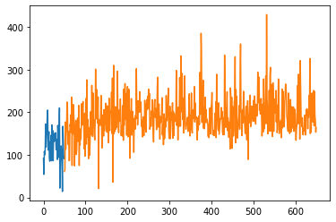

# A PyTorch implementation of Advantage weighted Actor-Critic (AWAC)

## Requirements

- Pytorch
- gym
- matplotlib

## `AWAC` Class

`AWAC` class only supports discrete action space (Dec 30th, 2020)

(Disclaimer) I developed the codes in this repository based on [the original AWAC paper](https://arxiv.org/abs/2006.09359). Hence, the code may contain
not correct implementation of what the actual paper intended.

````python
class AWAC(nn.Module):
    def __init__(self,
                 critic: nn.Module,  # Q(s,a)
                 critic_target: nn.Module,
                 actor: nn.Module,  # pi(a|s)
                 lam: float = 0.3,  # Lagrangian parameter
                 tau: float = 5 * 1e-3,
                 gamma: float = 0.9,
                 num_action_samples: int = 1,
                 critic_lr: float = 3 * 1e-4,
                 actor_lr: float = 3 * 1e-4,
                 use_adv: bool = False):
````

- `critic`: State-action value function Q(s,a)
- `critic_target`: the target network of Q(s,a)
- `actor`: An discrete actor. Note that the output of `actor` is logit.
- `lam`: Lagrangian parameter of the AWAC actor loss. Assume to be a strictly positive value.
- `tau`: the Polyak parameter for updating the target network.
- `gamma`: The discount factor of target MDP
- `num_action_samples`: Number of action samples for updating critic.
- `critic_lr`: Learning rate of critic
- `actor_lr`: Learning rate of actor
- `use_adv`: If `True`, use advantage value for updating actor. Else use Q(s,a) for updating actor.

## Examples
You can find the running example of `AWAC` on `gym` `cartpole-v1` environment from `AWAC-example.ipynb`.

## Experiment Results

It is confirmed that `AWAC` can learn better policy than its behavior policy in offline mode.

### Offline dataset preparation
- Prepare the offline dataset by using a good enough DQN (well trained but with a 40% chance act randomly)
- 50 independent `cartpole-v1` trial were made.



- The values on the x-axis show how long each episode was. (Longer is better)
- The values on the y-axis indicate the frequency of the episode lengths.

### Offline training

- After training 8000 gradient steps with 1024 sized mini-batch, `AWAC` was able to learn
  a policy better than the one of `good enough DQN`.



- The blue distribution shows the performance distribution of the `good enough DQN`.
- The orange distribution shows the performance distribution of the offline trained `AWAC`.

### Online finetuning

- After `AWAC` trained on 600 episode amount of online training,
  `AWAC` shows even better control performance. (offline trained `AWAC` + 600 ep online training)



- Moreover, the `AWAC` didn't show the 'dip', a phenomenon that indicates sudden performance drop right after online training



- The blue curve shows the performance of `AWAC` trained on the **offline** dataset only
- The orange curve shows the performance of `AWAC` trained in **online** mode. i.e.,
  the samples from replay memory would contain some amount of distributional shift.

- Also confirmed that even we clear the memory right before start to online training,
  the `AWAC` still can learn well.
